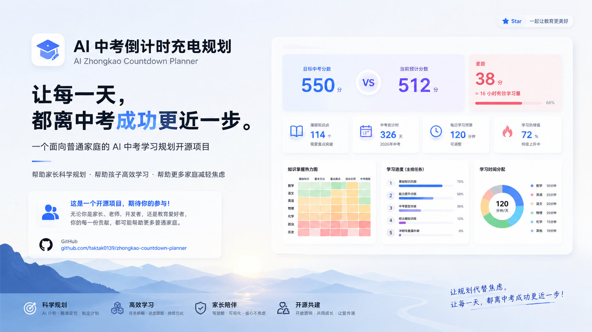

# AI 中考倒计时充电规划（AI Zhongkao Countdown Planner）

> **让每一天，都离中考成功更近一步。**

> 一个面向普通家庭的 AI 中考学习规划开源项目。

---

# 这不是一个成熟的产品。

它只是一个正在成长中的 Prototype（原型）。

但我相信，它值得被完成。

---

# 为什么会有这个项目？

距离中考，每一天都在倒计时。

每过去一天，留给孩子补齐知识短板的时间就少一天。

很多家长都知道初二升初三的暑假很重要，却不知道应该从哪里开始。

应该先补数学？

还是先补英语？

每天学习多久？

哪些知识点最重要？

哪些内容应该暂时放一放？

真正让很多家庭焦虑的，

不是时间不够，

而是不知道今天应该把时间花在哪里。

为了帮助自己的孩子备战中考，我开始尝试借助 AI，搭建一套能够帮助普通家庭科学规划学习的工具。

在不断开发过程中，我发现：

这不是我一个家庭的问题。

这是很多普通家庭共同面对的问题。

于是，我决定把这个项目开源。

不是因为它已经足够成熟。

恰恰相反。

正因为它还不够完善，所以我希望更多人一起参与，把它真正做成一个能够帮助普通家庭的工具。

---

# 我希望邀请你，一起完成它。

如果你是：

- 家长
- 老师
- 教育工作者
- AI 爱好者
- 开发者
- 产品经理
- UI / UX 设计师

欢迎一起参与这个项目。

无论是一条建议、

一份知识库、

一次代码优化、

一个产品想法、

还是一次真实使用反馈，

都可能帮助更多普通家庭。

我相信：

一个真正优秀的教育工具，

不应该属于一个人。

而应该由更多愿意帮助孩子成长的人，

共同创造。

---

# 项目定位

这不是一个刷题软件。

不是一个题库。

也不是一个暑期作业生成器。

它希望解决一个更基础的问题：

> **如何帮助普通家庭拥有科学规划中考学习的能力。**

我们希望借助 AI，

把老师多年积累的学习规划经验，

逐步沉淀为每一个家庭都可以使用的工具。

---

# 目前已经完成

目前已经完成第一版 Prototype，主要包括：

✅ AI 学情诊断

根据学生测试结果，

分析：

- 当前学习水平
- 薄弱知识点
- 知识掌握情况
- 与目标之间的差距

帮助学生知道：

**我现在在哪里。**

---

✅ AI 学习规划

根据：

- 中考倒计时
- 暑期时间
- 每日学习预算
- 知识点优先级

自动生成学习 Timeline。

帮助学生知道：

**今天应该学什么。**

---

✅ 每日学习任务

自动拆分每日学习计划。

支持：

- 学习预算
- 主线进度
- 知识热力图
- 薄弱积压量

让学习真正能够坚持下去。

---

✅ 家长驾驶舱

帮助家长了解：

- 今天有没有完成学习
- 哪些知识点仍然薄弱
- 哪门学科需要支持
- 是否偏离学习规划

家长不用替代老师讲题，

也能够真正陪伴孩子成长。

---

# 为什么选择开源？

我不是专业程序员。

我只是一个普通家长。

我相信，

真正有价值的教育工具，

不应该由一个人完成。

所以，

我希望把整个开发过程公开。

欢迎更多老师、

开发者、

产品经理、

设计师、

以及家长，

一起完善它。

如果未来它真的能够帮助更多孩子，

那一定不是因为我写了多少代码，

而是因为有很多人，

一起相信这件事情值得完成。

---

# Roadmap

## 已完成

- [x] 学情诊断
- [x] 暑期学习规划
- [x] AI 学习 Timeline
- [x] 家长驾驶舱
- [x] 每日学习任务

## 正在进行

- [ ] 更多地区中考知识库
- [ ] AI 学习建议优化
- [ ] 更多学习模型支持
- [ ] 教师模式
- [ ] 云端同步

---

# 欢迎参与

如果你认同这个方向，

欢迎：

- 提交 Issue
- 提交 Pull Request
- 分享真实使用反馈
- 分享各地区中考资料
- 提出产品建议

也欢迎 Star ⭐ 这个项目。

你的每一个建议，

都有可能帮助更多普通家庭。

---

# 写在最后

教育，

不应该只是刷更多的题。

更重要的是：

让每一天的努力，

都有方向。

---

> **让规划代替焦虑。**

> **让每一天，都离中考成功更近一步。**